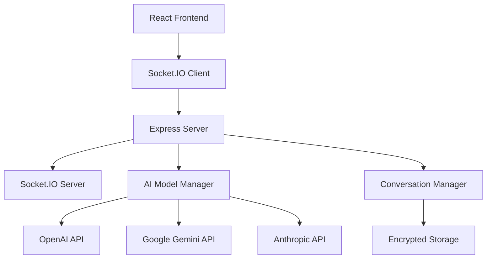

# 🤖 Conversation-LLMulator

<div align="center">

[](https://github.com/boshjerns/Conversation-LLMulator/stargazers)


**A real-time multi-AI conversation platform where different AI models engage in dynamic discussions**

[](https://nodejs.org/)
[](https://reactjs.org/)
[](https://www.typescriptlang.org/)
[](https://socket.io/)
[](https://opensource.org/licenses/MIT)

[🚀 Quick Start](#-quick-start) • [✨ Features](#-features) • [🎯 Demo](#-demo) • [📖 Documentation](#-documentation) • [🤝 Contributing](#-contributing)

</div>

---

## 🎯 What is Conversation-LLMulator?

Conversation-LLMulator is an innovative platform that orchestrates conversations between multiple AI models from different providers. Watch as GPT-4, Gemini, and Claude engage in natural, contextual discussions with adaptive response lengths and persistent conversation memory.

### 🌟 Why Conversation-LLMulator?

- **🧠 Multi-AI Intelligence**: Harness the unique strengths of different AI models
- **💬 Natural Conversations**: AI models respond contextually with human-like dialogue flow
- **🎭 Adaptive Responses**: Smart length variation based on conversation context
- **🧩 Memory Persistence**: Maintains conversation goals and context throughout discussions
- **⚡ Real-time Experience**: Live updates with typing indicators and seamless flow

---

## ✨ Features

### 🤖 **Multi-AI Support**
- **OpenAI**: GPT-4, GPT-4 Turbo, GPT-3.5 Turbo
- **Google**: Gemini 2.0 Flash, Flash Lite, 2.5 Flash Preview, 2.5 Pro Preview  
- **Anthropic**: Claude 3 Opus, Sonnet, Haiku

### 🧠 **Intelligent Conversation Management**
- **Adaptive Response Length**: Short (1-2 sentences) → Medium (2-4 sentences) → Long (4-6 sentences)
- **Conversation Memory**: Persistent goal tracking throughout discussions
- **Context Awareness**: Full conversation history with speaker identification
- **Natural Flow**: Contextual responses that build on previous messages

### 🔒 **Security & Privacy**
- **Encrypted API Keys**: AES encryption for secure storage
- **Rate Limiting**: Protection against abuse
- **CORS Protection**: Secure cross-origin requests
- **Session Management**: Persistent user sessions

### 🎨 **User Experience**
- **Real-time Updates**: WebSocket-powered live conversations
- **Color-coded Messages**: Visual distinction between AI models
- **Typing Indicators**: See which AI is currently "thinking"
- **Responsive Design**: Beautiful Material-UI interface
- **Conversation Control**: Start/stop conversations anytime

---

## 🚀 Quick Start

### Prerequisites

```bash
Node.js 16+ 
npm or yarn
API keys for desired AI providers
```

### Installation

1. **Clone the repository**
   ```bash
   git clone https://github.com/yourusername/conversation-llmulator.git
   cd conversation-llmulator
   ```

2. **Install dependencies**
   ```bash
   npm run install-all
   ```

3. **Start the application**
   ```bash
   npm run dev
   ```

4. **Open your browser**
   ```
   http://localhost:3000
   ```

### 🔑 API Key Setup

| Provider | Get Your Key | Documentation |
|----------|--------------|---------------|
| **OpenAI** | [platform.openai.com](https://platform.openai.com/api-keys) | [OpenAI Docs](https://platform.openai.com/docs) |
| **Google** | [makersuite.google.com](https://makersuite.google.com/app/apikey) | [Gemini Docs](https://ai.google.dev/docs) |
| **Anthropic** | [console.anthropic.com](https://console.anthropic.com/) | [Claude Docs](https://docs.anthropic.com/) |

---

## 🎯 Demo

### Starting a Conversation

1. **Configure API Keys** 🔑
   - Click the settings icon (⚙️)
   - Enter your API keys
   - Keys are encrypted and stored securely

2. **Select AI Models** 🤖
   - Choose companies from dropdown
   - Select 2+ AI models
   - Mix and match different providers

3. **Launch Discussion** 🚀
   - Enter an initial prompt
   - Watch AI models converse naturally
   - Stop anytime or let it run to completion

### Example Conversation Flow

```
User: "What's the best way to make a billion dollars?"

GPT-4: "Building a unicorn startup is probably the most realistic path, though it requires..."

Gemini: "Absolutely! The key is finding a massive market problem and creating a scalable solution..."

Claude: "I'd add that timing and execution are crucial. Many great ideas fail due to..."

GPT-4: "That's a great point about timing. Market readiness can make or break even..."
```

---

## 🏗️ Architecture



### Tech Stack

| Layer | Technology | Purpose |
|-------|------------|---------|
| **Frontend** | React + TypeScript + Material-UI | User interface and interactions |
| **Backend** | Node.js + Express | API server and business logic |
| **Real-time** | Socket.IO | Live conversation updates |
| **AI Integration** | OpenAI, Google, Anthropic SDKs | AI model communication |
| **Security** | AES Encryption, Helmet.js | Data protection and security |

---

## 🧠 How It Works

### Conversation Memory System

```javascript
// Memory Layers
1. Message History Memory    // Last 20 messages for context
2. Goal Memory              // Initial conversation objective  
3. Context Memory           // Full conversation transcript
4. Session Memory           // User sessions and API keys
```

### Adaptive Response Engine

The Conversation-LLMulator uses intelligent prompting to ensure natural conversation flow:

- **Short Responses** (1-2 sentences): Quick acknowledgments, simple reactions
- **Medium Responses** (2-4 sentences): Explanations, building on ideas  
- **Long Responses** (4-6 sentences): Complex topics requiring depth

### Context Injection

Each AI model receives:
```
System Prompt: "You are participating in a multi-AI conversation about: [GOAL]"
+ Full conversation history
+ Instructions for natural response length
+ Reminder to stay on topic
```

---

## 📖 Documentation

### Configuration

#### Environment Variables
```bash
# server/.env
PORT=5000
ENCRYPTION_KEY=your-secret-key-change-this
```

#### Conversation Settings
```javascript
// Adjustable parameters
MAX_MESSAGES = 30           // Conversation length limit
RESPONSE_DELAY = 2000       // Delay between AI responses (ms)
MAX_TOKENS = 300           // Token limit per response
HISTORY_LIMIT = 20         // Messages sent for context
```

### API Reference

#### Socket Events

| Event | Direction | Purpose |
|-------|-----------|---------|
| `setApiKey` | Client → Server | Store encrypted API key |
| `startConversation` | Client → Server | Begin AI conversation |
| `stopConversation` | Client → Server | End active conversation |
| `newMessage` | Server → Client | New AI response |
| `aiThinking` | Server → Client | AI is generating response |
| `conversationEnded` | Server → Client | Conversation completed |

---

## 🎨 Customization

### Adding New AI Models

1. **Update model configuration**
   ```javascript
   // client/src/App.tsx
   const AI_MODELS = [
     {
       id: 'new-model',
       name: 'New Model',
       company: 'provider',
       color: '#ff6b35'
     }
   ];
   ```

2. **Add API integration**
   ```javascript
   // server/index.js - AIModelManager
   async generateNewModelResponse(messages, model) {
     // Implementation
   }
   ```

### UI Theming

```css
/* client/src/index.css */
.message-newmodel {
  background-color: #your-color;
  color: white;
}
```

---

## 🚀 Deployment

### Local Development
```bash
npm run dev          # Start both server and client
npm run server       # Server only
npm run client       # Client only
```

### Production Build
```bash
npm run build        # Build client for production
npm start           # Start production server
```

### Docker Support
```dockerfile
# Coming soon - Docker configuration
```

---

## 🤝 Contributing

We welcome contributions! Here's how to get started:

### Development Setup

1. **Fork the repository**
2. **Create a feature branch**
   ```bash
   git checkout -b feature/amazing-feature
   ```
3. **Make your changes**
4. **Test thoroughly**
5. **Submit a pull request**

### Contribution Guidelines

- 🧪 **Testing**: Ensure all features work with multiple AI providers
- 📝 **Documentation**: Update README for new features
- 🎨 **Code Style**: Follow existing patterns and conventions
- 🔒 **Security**: Never commit API keys or sensitive data

### Areas for Contribution

- 🤖 **New AI Providers**: Add support for additional AI models
- 🎨 **UI/UX**: Improve interface and user experience  
- 🔧 **Features**: Conversation export, themes, advanced settings
- 📱 **Mobile**: Responsive design improvements
- 🧪 **Testing**: Unit tests and integration tests

---

## 🐛 Troubleshooting

<details>
<summary><strong>Common Issues</strong></summary>

### Server Connection Issues
```bash
# Check if server is running
curl http://localhost:5000/health

# Expected response
{"status":"OK","timestamp":"..."}
```

### API Key Problems
- ✅ Verify keys are valid and have sufficient credits
- ✅ Check key permissions for chosen models
- ✅ Ensure keys are properly saved in settings

### Empty AI Responses
- ✅ Check server console for error messages
- ✅ Verify API quotas and rate limits
- ✅ Try different AI models

### Installation Issues
```bash
# Clean install
rm -rf node_modules package-lock.json
npm install
```

</details>

---

## 📊 Roadmap

### 🎯 Current Version (v1.0)
- ✅ Multi-AI conversations
- ✅ Adaptive response lengths  
- ✅ Conversation memory
- ✅ Real-time updates
- ✅ Secure API key management

### 🚀 Upcoming Features (v1.1)
- 🔄 Conversation export/import
- 🎨 Custom themes and UI customization
- 📱 Mobile app support
- 🤖 Additional AI providers (Cohere, Hugging Face)
- 📊 Conversation analytics

### 🌟 Future Vision (v2.0)
- 🧠 AI personality customization
- 🎭 Role-playing scenarios
- 🌐 Multi-language support
- 🔗 Integration with external tools
- 👥 Multi-user conversations

---

## 📄 License

This project is licensed under the MIT License - see the [LICENSE](LICENSE) file for details.

---

## 🙏 Acknowledgments

- **OpenAI** for GPT models and excellent API documentation
- **Google** for Gemini AI and developer-friendly tools  
- **Anthropic** for Claude and responsible AI development
- **React Team** for the amazing frontend framework
- **Socket.IO** for seamless real-time communication
- **Material-UI** for beautiful, accessible components

---

## 📞 Support & Community

- 🐛 **Issues**: [GitHub Issues](https://github.com/boshjerns/Conversation-LLMulator/issues)
- 💬 **Discussions**: [GitHub Discussions](https://github.com/boshjerns/Conversation-LLMulator/discussions)  
- 📧 **Email**: support@conversation-llmulator.com
- 🐦 **X (Twitter)**: [@boshjerns](https://twitter.com/boshjerns)

---

<div align="center">

**Made with ❤️ by @boshjerns**

⭐ **Star this repo if you find it useful!** ⭐

[🔝 Back to Top](#-conversation-llmulator)

</div> 